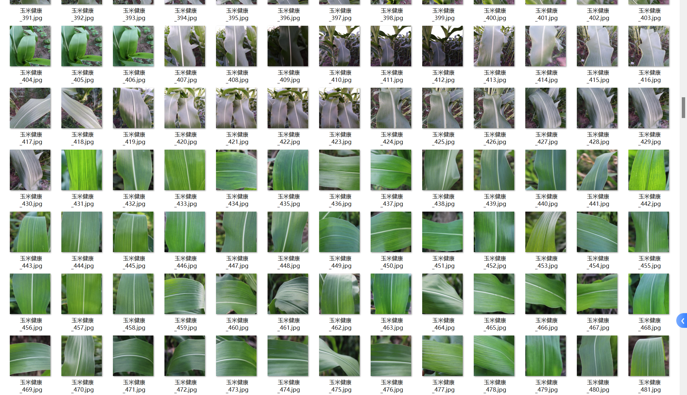
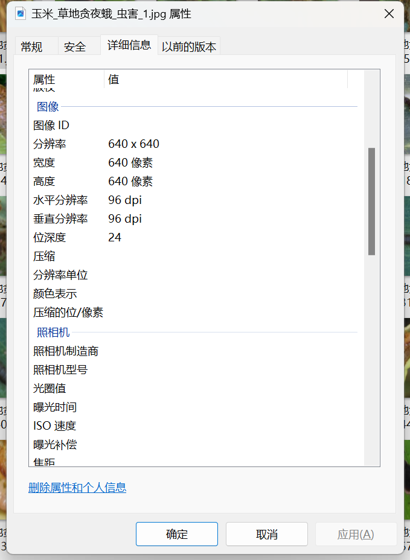

# Corn Leaf Disease and Pest Image Classification Dataset

Comprehensive Dataset Introduction:
- Number of Images in the folder "Corn_grasshopper_pest": 285
- Number of Images in the folder "Corn_grasshopper_pest": 673
- Number of Images in the folder "Healthy_corn": 1689
- Number of Images in the folder "Corn_necrotic_blight": 985
- Total number of images across all subfolders: 4145

Overall Preview:
+++++++++++++++++++++++++++++++++++++++++++++++++++++++++++++++++++++++++++++++++++++++++++++++++++++++++++++++++++++++++++++++++++++++++++++++++++++++++++++++++++++++++++++++++++++++++++++++++++++++++++++++++++++++++++++++++++++++++++++++++++++++++++++++++++++++++++++++++++++++++++++++++++++++++++++++++++++++++++++++++++++++++++++++++++++++++++++++++++++++++++++++++++++++++++++++++++++++++++++++++++++++++++++++++++++++++;

## Images

Here is a pay link on Stripe ( https://buy.stripe.com/3cs8yP7sY87d0vu9AB ). Please contact me lonlonago@foxmail.com after funding $89, and I will send you a complete data files , thank you!

